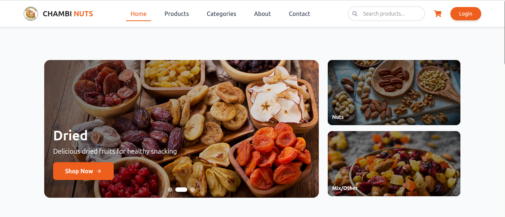
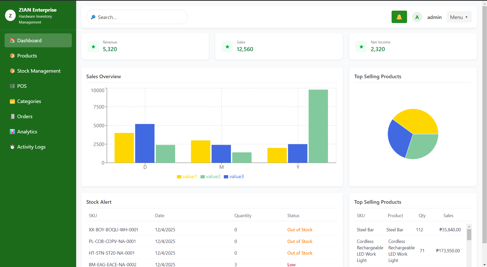
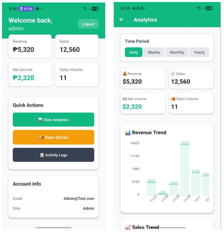
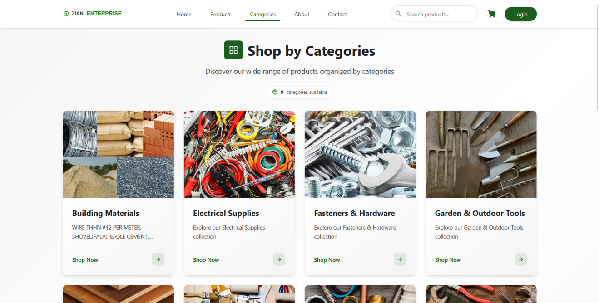
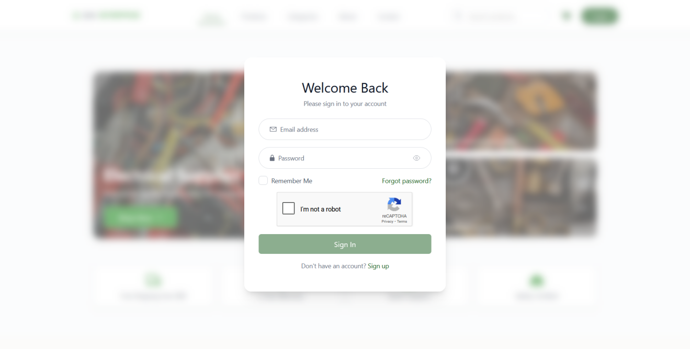
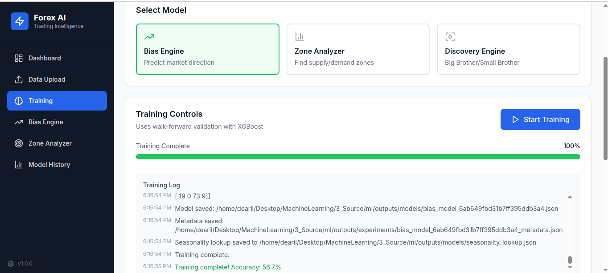

<h1 align="center">Greetings, I'm Rain Idala 👋</h1>

  <strong>Full Stack Developer · Backend Engineer · AI/ML Builder</strong>

  Building full-stack applications, backend systems, developer tools, and AI-powered software.

  
  

---

## 🧰 Tech Stack

  
  
  
  

  
  
  
  
  
  

  
  
  
  
  
  
  

  
  
  
  
  

---

## 🚀 Featured Projects

### 🛒 Chambi Nuts

**E-Commerce & Inventory Platform**

Production e-commerce and inventory system built for a real business, covering customer shopping, inventory workflows, payments, shipping, authentication, and real-time operations.

  

  

**Highlights:**

* E-commerce and inventory management
* Payment and shipping integrations
* Authentication and role-based access control
* Real-time application workflows
* REST API and database architecture

---

### 🏢 Zian Enterprise

**Multi-Platform Business Management System**

A business management platform spanning web, desktop, and mobile applications, with shared backend services and synchronized operational data.

  

  
  

  

**Highlights:**

* Web-based business management
* Desktop/POS application
* Mobile analytics
* Customer-facing e-commerce workflows
* Authentication and account management
* Real-time data synchronization

**Stack:** React · React Native · Expo · Electron · Node.js · Express · MongoDB · Socket.io

---

### 🧠 GLINK-X

**Autonomous Repository Intelligence & RAG Engine**

A personal AI engineering project focused on understanding software repositories and assisting with development workflows.

**Highlights:**

* Repository-aware semantic retrieval
* Code chunking and embeddings
* AST-based repository analysis
* Dependency and code relationship analysis
* Context ranking and token-budget management
* AI-generated development plans
* Local verification and controlled patch execution
* Git checkpoints and rollback

**Stack:** Python · RAG · LLMs · Ollama · MongoDB · AST Analysis

---

### 📈 Quantitative Intelligence & Time-Series ML Platform

**Machine Learning & Model Evaluation Platform**

A full-stack machine-learning platform focused on time-series modeling, validation, explainability, and model evaluation.

  

**Highlights:**

* XGBoost and Scikit-Learn
* Leakage-aware walk-forward validation
* Causal feature engineering
* Model benchmarking
* SHAP explainability
* Probability calibration
* Brier score and log loss
* ROC-AUC and F1 evaluation
* React/Vite visualization
* Node.js/Express integration
* MongoDB model and training metadata

**Stack:** Python · XGBoost · Scikit-Learn · Pandas · NumPy · React · Node.js · MongoDB

> Client projects are not publicly published because their source code and business information are proprietary.

---

## 📊 GitHub Analytics

  
  

### ⚙️ Engineering Focus

  
  
  
  
  
  

---

## 📫 Connect

  

  <i>Building software, experimenting with AI, and occasionally convincing computers to cooperate.</i>

